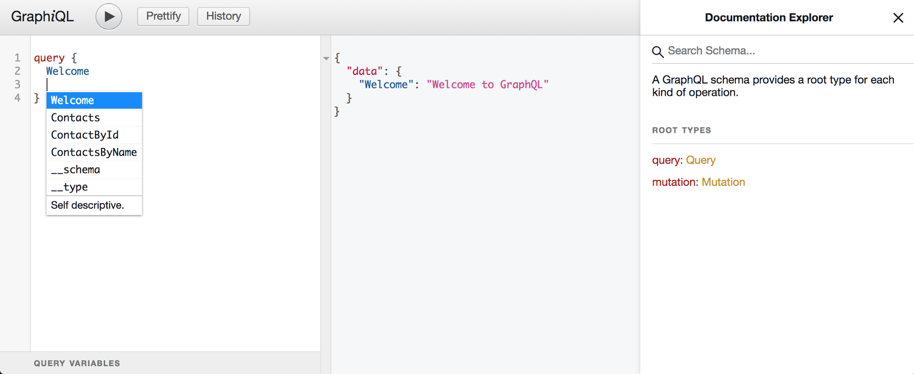
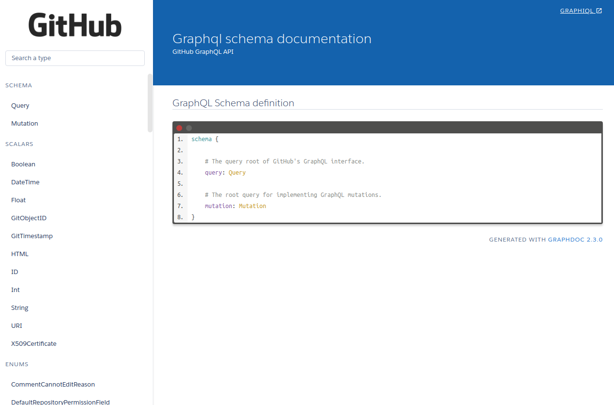

# GraphQL Best Practices


So you may have heard of how 
 [GraphQL](http://graphql.org) has made REST APIs [REST-in-peace APIs](https://medium.freecodecamp.org/rest-apis-are-rest-in-peace-apis-long-live-graphql-d412e559d8e4), 
and even started using GraphQL for some of your projects. I've had the pleasure of working with GraphQL at my past three jobs and have picked up
quite a few practical tips that can help you transition away from REST APIs toward GraphQL. For the purposes of this guide, I'm going to 
assume you're using [Apollo's GraphQL ecosystem](https://www.apollographql.com), though the general ideas are applicable regardless of which GraphQL flavor you're using.  Let's get to it, here are my GraphQL Best Practices:

### Use Mock Mode

We all know the story of needing to build out a one-off Mock API for some testing purpose. As easy as Express.js makes it to quickly wire up a dummy REST server, 
GraphQL comes with mocking [out of the box](https://www.apollographql.com/docs/graphql-tools/mocking.html) using your existing schema in a handful of lines:
 
 ```javascript
// mockSchema.js
import { makeExecutableSchema, addMockFunctionsToSchema } from 'graphql-tools';
import typeDefs from './typeDefs'

// Create a schema with no resolvers
const schema = makeExecutableSchema({
   typeDefs
});
 
// Add mock functions to your schema
addMockFunctionsToSchema({
   schema,
});

// Export a fully functioning schema that resolves correctly typed data
export default schema;
```
You might be wondering how GraphQL is actually resolving your types if we haven't provided any resolvers. 
Since all GraphQL fields ultimately resolve to Scalar types, GraphQL uses these type definitions to automatically respond with correctly typed data. If you'd like more manual control of your mocks 
(so they output real data and not just UUID looking strings for example), you can also provide a `mocks` [object option](https://www.apollographql.com/docs/graphql-tools/mocking.html#addMockFunctionsToSchema) 
to the `addMockFunctionsToSchema` call containing your own mocks. 

This technique has been essential for front end development&mdash;quickly seeing how my 
components behave on my client side apps without needing to spin up actual backend servers has greatly cut down iteration time. 
Mocking is also really useful for testing. In general, having your server able to 
output real data without needing a backing resolver / db is the kind of decoupling that makes for developer-happy architectures.

### Automate Your Documentation

Wouldn't it be nice if we could just get automated easy-to-share documentation for all our backend API's? 
GraphQL makes this easy.



The batteries-included Documentation Explorer in GraphiQL is already a massive upgrade from most 
undocumented REST API's in the wild. You can turbo-charge this feature however by taking advantage of the [Markdown description support](https://www.apollographql.com/docs/graphql-tools/generate-schema.html#descriptions) available
for your entire GraphQL Schema. This allows you to add helpful Markdown-enabled descriptions for fields 
and even arguments that may not be immediately clear by their names, as well as mark certain fields as deprecated so other developers know not to use them. 
In practice, I've found it best to include documentation as part of a PR check so you can keep your backend continuously documented over time.

So you now have this awesome body of documentation for your backend, how do we actually share this? Enter `graphdoc`! [Graphdoc](https://github.com/2fd/graphdoc) is a package that generates 
a static documentation site based on your GraphQL schema. If you tie this into 
your CI/CD pipeline, you can have a setup such that merges to master automatically trigger an internal facing deployment of the site generated by `graphdoc`. 
This results in an always up-to-date link that anyone in your company can use to figure out what data is available and exactly what Query to write to get that data. 
Here's an [example with the public Github GraphQL schema](https://2fd.github.io/graphdoc/github/). 



Here's a [github gist](https://gist.github.com/jsjaspreet/9cbe9b8dd629c0d1b8c05ddd00b80c63) showing how you can integrate this workflow in your project.

So the next time someone asks you "How do I get that data?", tell them to RTFM with a link to your deployed graphql docs.
 
### Control Public Access through Whitelisting

After you're done building your app, you may wonder if there are any steps to take before making your GraphQL API public. 

While GraphQL's flexibility makes development a breeze by allowing you to query for exactly the data you needed for your client app, 
an unprotected public GraphQL endpoint is susceptible to 
easy DDoS attacks through both recursive deep queries (imagine a parent child relationship in your GraphQL schema which recurses `parent { child { parent ... } }` 
with a naive resolver implementation) or wide queries which request every top level field. A single such client request can trigger hundreds of underlying backend requests if you do not lock down access patterns or have another 
way of detecting improper access (perhaps by limiting depth of subfields, limiting total number of top level fields in a single GraphQL request, intentionally designing your schema as a DAG).

One way of locking down requests is through [whitelisting operations](https://github.com/apollographql/apollo-server#whitelisting) for your public facing GraphQL API. 
This Apollo feature allows you to declare in advanced what queries/mutation are acceptably resolved by your GraphQL Server, while rejecting all other arbitrary queries. For client side apps, this does mean 
figuring out what queries/mutations you'll need in advanced, but there are libraries such as [PersistGraphQL](https://github.com/apollographql/persistgraphql) that can help you extract your queries from your client-side apps automatically.

It's interesting to note that whitelisting is equivalent to declaring the routes you'd expose with a traditional REST API.

### Conclusion
  
I hope you've found these techniques to be useful in thinking about how you can take your GraphQL usage to the next level, or possibly consider introducing GraphQL in your stack for your next project. 
There are other techniques that you may also find helpful, such as using Facebook's `data-loader` for [efficient database 
access](https://github.com/facebook/dataloader) or splitting up a monolithic GraphQL API into smaller GraphQL microservices that are combined through [schema-stitching](https://www.apollographql.com/docs/graphql-tools/schema-stitching.html). 
I've used nearly all of these techniques in production so if you have any questions, feel free to reach out. 

For me personally, the thing that astounds me about GraphQL isn't just the awesome technical solutions it enables, 
but also the organizational impact of a more decoupled environment where teams can develop 
independently of one another and focus more on upholding public contracts rather than knowing too much about each others' internal implementations.

Thanks for reading, now go code those GraphQL APIs!
