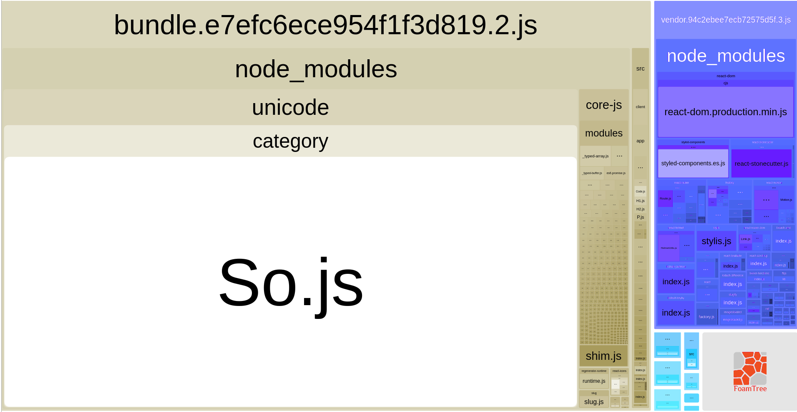
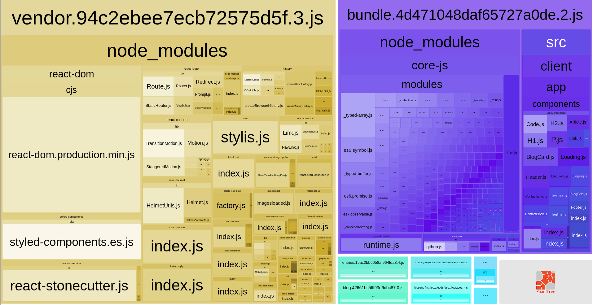

# Optimizing Webpack Bundles for Production React Apps

In building this site, I wanted to practice techniques for limiting bloat and unnecessary network requests
that inevitably creep into most front end projects that don't put perf first. 
Here are three techniques outside of the obvious basic gzip + CDN Caching that you may find helpful in making your site more efficient.

## Code Split with React Router v4 and React Loadable

There's already a great [guide](https://github.com/jamiebuilds/react-loadable#------------guide) on the
`react-loadable` github page, but the basic idea is that you can split up your website into different
bundles based on routes. This is really important for homepages for example where you may have just a simple splash page, but your 
site is downloading tons of unnecessary javascript that may not be needed at all if for example a user doesn't login. 
Image from the github showing this difference in bundling:


Beyond route level code splitting, sometimes it also makes sense to split out some data specific bundle that you'd like
to live separately from your visual library code, for caching purposes for example. Whenever I deploy a new blog post for example,
it doesn't make sense to bust the cache for the entire `/blog` route, wouldn't it make more sense to just bust a data specific cache that contains a list of all possible blog entries? 
That's exactly what I do, here's the code below that takes advantage of the dynamic import syntax to import a DAO for my blog posts:
```js
async componentDidMount() {
  const db = await import(/* webpackChunkName: "db" */ '../../database/dao.js');
  this.setState({ db: db.default });
}
```

## Understand the cost of dependencies

Without understanding the weight of your production dependencies, 
you're bound to ship megabytes over the wire for some functionality
that could fit in kilobytes instead. You should ideally include some sort of automated process for every PR that 
if there is a package.json change, show what the effects are on the production build bundles. 

One easy way of doing this is through [Webpack Bundle Analyzer](https://www.npmjs.com/package/webpack-bundle-analyzer).

Real world use case: I needed a way to create URL safe routes for this site for my blog posts based on their titles, and typically the way I've seen 
this done is through some slug process, so I first decided to use the `slug` package for this feature. When I went to build my site however, I was shocked at how much extra weight was
tacked on by what I assumed was a simple library. I ended up using Webpack Bundle Analyzer to first detect this issue, and then swapped it out
for a slimmer library `slugify` that fit my simple purposes. Visuals from Webpack Bundle Analyzer below:

With `slug`, the vendor bundle gzip size is 137.92 KB and visually dwarfs the rest of the bundles:



With `slugify`, the vendor bundle gzip size is 88.86 KB, massive improvement:


 

## Optimize your imports

While many libraries are adopting the 
new `sideEffects` [webpack 4 standard](https://github.com/webpack/webpack/tree/master/examples/side-effects) to save 
you the trouble, you can bullet proof yourself by importing functionality from a library from where the code lives directly rather than from a top level index file.

Real world use case: This site uses a couple icons from the `react-icons` library. Instead of importing the entire library for the 2-3 icons I use, 
it's much better to import the components directly as shown below:

```js
import InboxIcon from 'react-icons/lib/fa/inbox';
import GithubIcon from 'react-icons/lib/fa/github';
import LinkedInIcon from 'react-icons/lib/fa/linkedin-square';
```

## Conclusion

I hope these techniques help you slim down your production bundles! 
If you have any other techniques you use, feel free to reach out and let me know!
